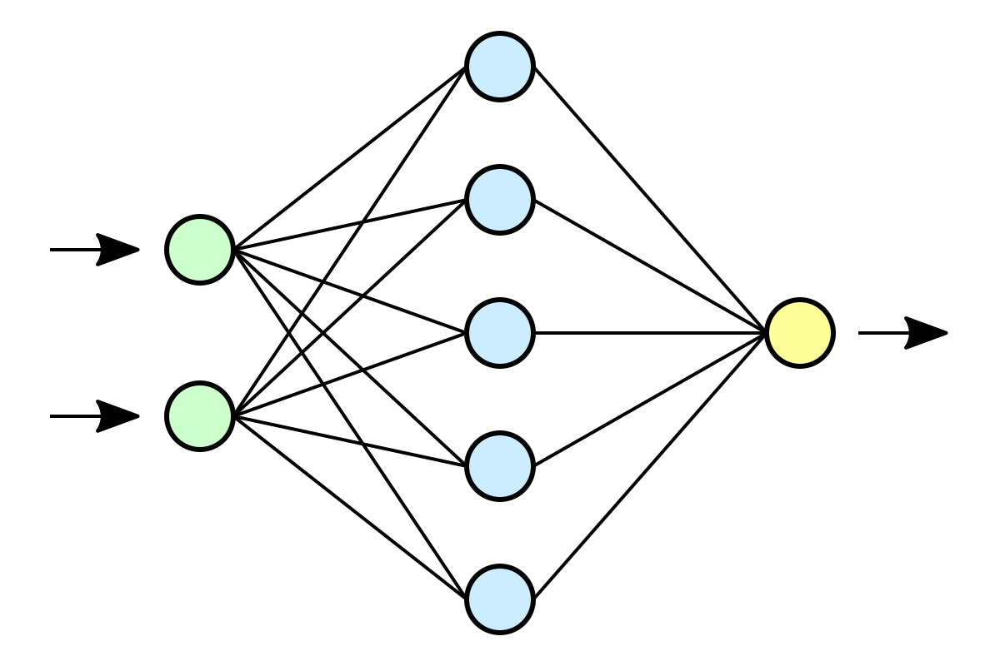
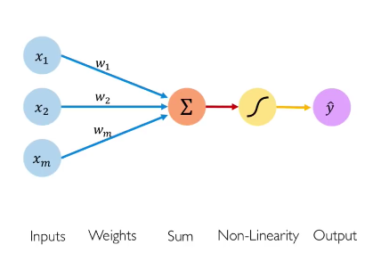

## How is a neuronal network structured
For many people a neuronal network is magic. If you never learnt what happens behind the scenes it looks like you just throw things in and eventually it can solve a problem.

A neuronal Network, as the name already suggests, is a network of multiple neurons.

<figure>
  
  <figcaption>
    A simplified representation of a neural network with two layers.
    <a href="https://commons.wikimedia.org/wiki/File:Neural_network.svg">(by Dake, Mysid. CC-BY 1.0)</a></figcaption>
</figure>

You give a input into it and through the interaction of the different neurons the result is formed.

## What is a Neuron

As you could see in the image above there are 3 types of neurons:

- **Green**:
  The green ones are input Neurons. The just have connections to their right and no other connections. These are used to input data into the neuronal network.
- **Blue**:
  The second type are the blue ones. How many columns (often called "layers") of them exist is not given and can be changed. They have connections to their left (input) and to their right (output). They take the inputs, process them and then generate an output.
- **Yellow**:
  The last type of neurons are the yellow one. They are at the end of the network. Their output is the output of the whole network.

All 3 types of the network can be described through one model

https://miro.medium.com/max/428/1*O7YSSqlOdQuNgMrH7J_3dg.png
<!-- TODO: License? Reference the Author in a footnote? -->

A neuron has multiple inputs. The inputs are the outputs of all neurons in the previous column.
These inputs get weights. For example if a input is 0.6 and the weight is 0.1 we take 0.6 * 0.1 and then we have the "real" input. Every input has its own weight. All of the inputs multiplied with the weight are added together. This sum is now put into a function. The function determines how much output is generated for the given sum. Often the function looks like this:

<!-- TODO: Alt text -->

https://miro.medium.com/max/357/1*oePAhrm74RNnNEolprmTaQ.png
<!-- TODO: License? Reference the Author in a footnote? -->

The output of this function (in this case RELU) is the output of the neuron and therefore the input for the next column of neurons.
If we have a description of the arrangement of the neurons and a list of all weights we can reproduce the network over and over with the same outputs for the same inputs. And these two informations are the core of a neuronal network. How the Neurons are arranged and what the weights are.

## What is Backpropagation
The structure of a network impacts its performance, but the best variable to shape it are the weights. If we get the right weights it should be perfect. Obviously getting good weights is hard. I know that I said this is without math, but we need a little bit. A neuronal network is like a function with millions of parameters(weights) which produces a deterministic result. We can imagine this like a 3D map.

https://bdtechtalks.com/wp-content/uploads/2020/04/gradient-descent-local-minima.png
<!-- TODO: License? Reference the Author in a footnote? -->

The lower we get the better our network performs. Finding the lowest point overall (Global Minima) is generally hard, as it is hard to express the desired function at all. We take a other approach. We start at a random point somewhere, so we just use random weights. Luckily we have a way to find the way which leads us from our point. This is called negative gradient. If you are interested in math you can research this on your own.

Now lets start learning. We guess some weights and start throwing inputs into the network. We compare the result of the network with the right results. Then we use the negative gradient and adjust the weights with these metrics. This process is repeated thousand or even millions of times until we find a local minima. If we reach it, we can't get out of the region of this minimum and have to take a look how our network performs. If the accuracy of the network is good enough we are finished. When the result is not good enough, we have to start again with other starting weights and repeat the learning process.

## How can we use this Knowledge in Practice

A good and easy way to start is to use pytorch: https://pytorch.org
This library allows us to build and train a network with nearly zero prior knowledge. So what are you waiting for?

