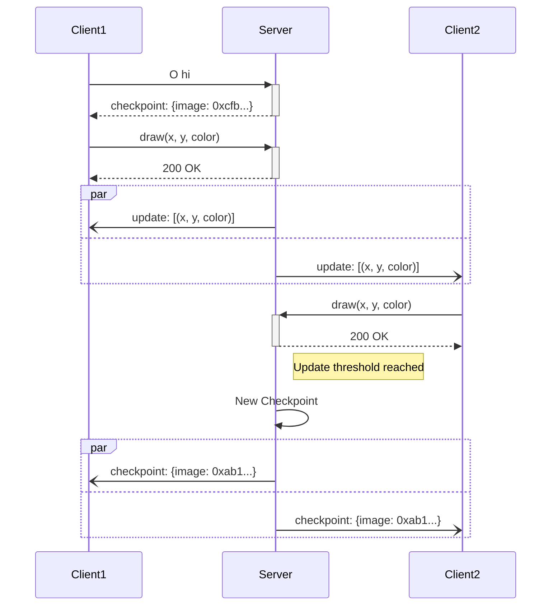

<!-- TODO: More Excalidraw stuff -->

Most internet people know (or have heard of) [Reddit's April Fools' 2017 /r/place](https://en.wikipedia.org/wiki/Place_(Reddit)). We wanted to implement this for the German image board pr0gramm.com.
<!-- TODO: Short description what that is -->

There are some write-ups about these kind of projects. [Reddit wrote about how they've implemented /r/place](https://www.redditinc.com/blog/how-we-built-rplace). Their requirements were:
> - The board must be 1000 tiles by 1000 tiles so it feels very large.
> - All clients must be kept in sync with the same view of the current board state, otherwise users with different versions of the board will have difficulty collaborating.
> - We should support at least 100,000 simultaneous users.
> - Users can place one tile every 5 minutes, so we must support an average update rate of 100,000 tiles per 5 minutes (333 updates/s).
> - The project must be designed in such a way that it’s unlikely to affect the rest of the site’s normal function even with very high traffic to r/place.
> - The configuration must be flexible in case there are unexpected bottlenecks or failures. This means that board size and tile cooldown should be adjustable on the fly in case data sizes are too large or update rates are too high.
> - The API should be generally open and transparent so the reddit community can build on it (bots, extensions, data collection, external visualizations, etc) if they choose to do so.

In general, we have the same requirements, but with smaller numbers as pr0gramm is a much smaller community and this is a 3rd-party project. More specifically, the numbers we aimed for are:
- 500x500 tiles
- Support 10,000 simultaneous users with temp. peaking to 20,000.
- One tile every 2-5 minutes. So 20,000 users will place `(20000 updates) / (2 minutes) == 10000 updates/minute`, which results in `166 updates/s`.

- **Requirements that reddit did not have:**
    - The image should only be visible to logged-in users
    - It has to run on low-tier hardware. This is a hobby project, so we don't have reddit's resources and _no_ pre-existing infrastructure. We aim to pay 5€ for a VPS (per month, and thus ~0.17 € for a weekend).

Regarding the updates/s: It is important to know that while 166 updates/s may happen, we must at the same time distribute those updates simultaneously to _all users_.

## Backend
We took a different approach as reddit.
<!-- TODO: Short description on what reddit does -->

### Implementation Decisions
We used a standard SQL database for this. Our core table is just a plain table that represents a time series of tile updates:
```sql
CREATE TABLE pixel_history (
    id INT GENERATED ALWAYS AS IDENTITY,
    x INT NOT NULL,
    y INT NOT NULL,
    account INT,
    color BYTEA NOT NULL, -- the valid color will be checked in application

    created_at TIMESTAMP WITH TIME ZONE DEFAULT CURRENT_TIMESTAMP,
    modified_at TIMESTAMP WITH TIME ZONE DEFAULT CURRENT_TIMESTAMP,

    PRIMARY KEY(id),
    CONSTRAINT fk_account FOREIGN KEY(account) REFERENCES account(id) ON DELETE SET NULL
);
```
So once a user sets a tile, a single row `(x, y, user-id, color)` is inserted into this table.

We can construct the image to every point in the from that, as we just need to `select x, y, color from pixel_history`. However, it is important to know that a `(x, y)` position may be updated multiple times. [Postgres has a feature called `DISTINCT ON`](https://stackoverflow.com/a/7630564) which comes to the rescue. It basically works like this:
```sql
SELECT DISTINCT ON (x, y)
    x, y, color, id as history_id
FROM pixel_history
```
Now, this will `SELECT DISTINCT` on `(x, y)`, not the entire row. This means that the values `color` and `id` are undefined at this point (it just takes "the first" entry). Next, we create an index on the `pixel_history` that orders the ID descending to address this:
```sql
CREATE UNIQUE INDEX idx_pixel_history_x_y_id
ON pixel_history (x, y, id DESC);
```
With that index in place, we're almost done. If we now order the `SELECT` query using `x, y, id DESC`, it will yield the `color` and `id` of the row with the highest `id`. That means, we always get the latest color value for each `(x, y)` coordinate.

```sql
SELECT DISTINCT ON (x, y)
    x, y, color, id as history_id
FROM pixel_history
ORDER BY x, y, id DESC
```

Using that setup, the latest image can be obtained with the single select query above. This can also be modified to create a "point in time" view of the image, which will be useful for later analysis.

#### Distributing Updates to Backend Services
Instead of Cassandra with a Redis cache, we decided to use Postgres with `PGnotify` only.

`PGnotify` allows the database to send notifications to the connected clients (in our case, the backend services). We send a notification to all backends as soon as a new tile gets inserted into the database. The message contains the data of the inserted pixel. To do that, there is a function `pg_notify(topic, contents)` that can be called from a query. We created a simple trigger on pixel insertion to notify all backend instances that there was a new placed tile:
```sql
CREATE OR REPLACE FUNCTION notify_pixel_change()
RETURNS trigger AS $$
BEGIN
    PERFORM pg_notify(
        'pixel_change',
        json_build_object(
            'offset', NEW.id,
            'x', NEW.x,
            'y', NEW.y,
            'color', encode(NEW.color, 'hex')
        )::text
    );
    RETURN NEW;
END;
$$ LANGUAGE plpgsql;
```

To receive notifications from the database in the backend, we just need to handle the `notification` event in the pg client.
```js
client.on("notification", message => {
    if (message.channel !== "pixel_change" || !message.payload)
        return;

    const payload = message.payload;

    let update;
    try {
        update = JSON.parse(payload);
        if (!update)
            return;
    } catch {
        console.error("Got invalid JSON via NOTIFY/LISTEN: " + payload);
        return;
    }

    console.log("Received pixel update:");
    console.table(update);
    // ...
    // Distribute this update to all clients
});

// tell the database that we're interested in the messages in that topic
client.query(`LISTEN pixel_change`);
```

This way, we don't need a separate event bus to keep all instances of the backend service up-to-date.

#### Mitigate Caching Problems / Packet Loss
Distributing the updates may not suffice because under heavy load, it may happen that some instance may run out of sync due to packet loss or lost updates.

To mitigate this, we decided to try two approaches:
1. Use a `MATERIALIZED VIEW` (MV) on the the `SELECT DISTINCT ON (x, y)` query from above. MVs need to be refreshed manually, so this has to be done every `n` inserts manually.
2. Create a second table called `image`, which is updated once a new tile is drawn. It does not contain the history, only the pixel data of the current image.

We decided to go with approach two for that, since that can be entirely automated and made transaction-safe by the database. Also, refreshing the entire MV by creating 500*500 (= 250000) entries could be costly (of course, 250000 rows is _nothing_ for postgres).

To implement option two, we again used a trigger that updates the `image` table, which is just a version of `pixel_history` without the history with a reference to the corresponding history entry:
```sql
CREATE TABLE image(
    x INT NOT NULL,
    y INT NOT NULL,
    color BYTEA NOT NULL,

    -- needed to retrieve the author of a tile that is currently viewed to the audience
    history_id INT NOT NULL,

    PRIMARY KEY(x, y),
    CONSTRAINT fk_history_id FOREIGN KEY(history_id) REFERENCES pixel_history(id) ON DELETE SET NULL
);

-- When something is inserted into pixel_history, we want to insert this into image as well (and overwrite, if already present)
CREATE TRIGGER update_image
AFTER INSERT OR UPDATE ON pixel_history
FOR EACH ROW
EXECUTE PROCEDURE update_pixel_table();

CREATE OR REPLACE FUNCTION update_pixel_table()
RETURNS trigger AS $$
BEGIN
    INSERT INTO image (x, y, color, history_id)
    VALUES (NEW.x, NEW.y, NEW.color, NEW.id)
    ON CONFLICT (x, y) DO UPDATE
        SET color = NEW.color, history_id = NEW.id;
    RETURN NEW;
END;
$$ LANGUAGE plpgsql;
```
This approach has the advantage that no manual "rebuilding" is needed. The DB handles the consistency of the `image` table for us. When in doubt, it can be re-created with a query like the `SELECT DISTINCT ON (x, y)` from above.
Instead of creating a large update every `n` inserts, we now do two inserts instead of one, where one is triggered by the database. This also simplifies the process of retrieving the author of a visible tile.

<!--
We also use triggers to update the `last_tile_placed` timestamp of the respective user. Another big advantage of using database triggers is that in PostgreSQL, a single statement has an implicit transaction wrapped around it. Also, every trigger that is fired during a transaction is also considered a part of the transactions. This ensures data integrity without a single explicit transaction or application-level code.
-->

During load tests, the Database was basically idleing, so we _think_ that design fits the problem. Of course, we know that we're basically abusing a table as a cache.
## Frontend
Frontend-wise, we also took a different approach than reddit.
<!-- TODO: Short description on what reddit does -->

### Implementation Decisions
As written in the blog post of reddit, they already have a robust, battle-tested infrastructure for WebSockets. So naturally, they used WebSockets to distribute live updates to the clients. We don't.

In the first prototype, we actually used WebSockets with a custom binary protocol to save traffic. Creating a packet looked something like this:
```ts
// ...
export function createUpdatesMessage(updates: Update[]) {
	const packetSize = PACKET_ID_SIZE + getUpdatesSize(updates);

	const message = Buffer.allocUnsafe(packetSize).fill(0);
	let currentOffset = 0;

	writePacketId(message, PACKET_ID_UPDATES, currentOffset);
	currentOffset += PACKET_ID_SIZE;

	writeUpdates(message, updates, currentOffset);
	currentOffset += getUpdatesSize(updates);

	return message;
};
// ...
export const PACKET_ID_SIZE = U8_SIZE;
function writePacketId(buffer: Buffer, id: number, offset: PacketOffset) {
	buffer.writeUInt8(id, offset);
}
// ...
```

This worked. However, as the backend will run behind some random reverse proxy, configuring it correctly _could_ involve pain. We decided to ditch WebSockets and use Server-Sent-Events instead. Server-Sent-Events is basically standardized Long-Polling, which has a [pretty simple JS API](https://developer.mozilla.org/en-US/docs/Web/API/EventSource). [There are some reasons to do this](https://germano.dev/sse-websockets). The core reasons for our use-case were:
<!-- TODO: Link to that over post mentioning the downsides -->

- We only need uni-directional data flow (WebSockets are bi-directional)
- No additional configuration for the reverse proxy, as it is just a long-running HTTP connection
- Leverages HTTP/2 multiplexing
- As it's an HTTP request, putting it behind authentication is trivial (so only logged-in users can retrieve updates)
- The JS API automatically manages re-connections in case the connection gets lost
- Retrieving missing data is part of the protocol. The client can set the `Last-Event-ID` header and will only get updates that he does not yet have.

There are some downsides:
- For some reason, the used backend framework is not able to use HTTP compression on SSE streams
- It is plain text

When we were using WebSockets, we basically re-implemented some of the SSE features listed above. As soon as we migrated to SSE, the code got a lot simpler, as we just passed JSON strings to the front end instead of writing/parsing a custom binary protocol that handles re-connections. Handling IO with SSE boils down to:

```js
const ac = new AbortController();
const eventOptions = { signal: ac.signal, passive: true };

const es = new EventSource("/events");
es.addEventListener("error", err => console.error(err), eventOptions);

es.addEventListener("checkpoint", event => {
	const checkpoint = JSON.parse(event.data);
	// draw checkpoint + associated updates
}, eventOptions);

es.addEventListener("updates", event => {
	const updates = JSON.parse(event.data);
	// draw updates
}, eventOptions);
```

**tl;dr**: SSE is the perfect approach for doing uni-directional data flow like push notifications of messages or live-updates of a timeline. However, if you want to implement push notifications for PWAs, [there is Web Push for that](https://stackoverflow.com/questions/29327408).

### Keeping Clients in Sync
The clients are much more volatile than our backend services, so we _need_ to handle data loss appropriately. We chose a simple approach to address this issue:

Every backend node collects all updates that it receives from the backend. As soon as it hits some specified number of updates, it creates a checkpoint (or "snapshot"). This checkpoint consists of an image of the area at that point in time. It also contains all updates to that image since that. Every new update is appended to the updates of the current checkpoint.

As soon as a new client connects, the first thing it receives is this checkpoint. After that, it only receives updates that happened afterwards.
When the backend creates a new checkpoint, it is distributed to _all_ clients. This mitigates problems with lost updates on the clients and synchronizes all clients to a new common ground.



## Stats
<!-- TODO: Stats on how it went and stuff -->
